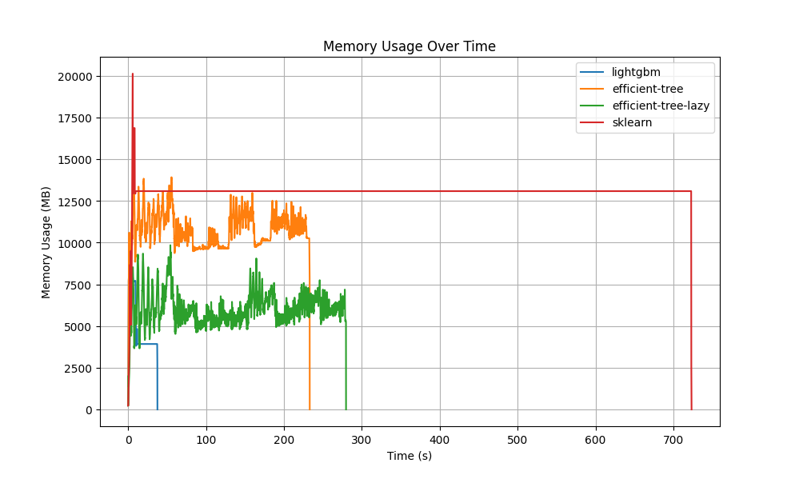

# Efficient-Trees

**Efficient-Trees** is a memory-optimized Python library for building decision trees and tree-based models, designed to handle large-scale datasets efficiently without requiring all the data to be loaded into memory. Powered by the high-performance **Polars** backend, it offers significantly faster training times and reduced memory consumption compared to traditional libraries like scikit-learn.

## Features

- **Memory Efficiency**: Processes large datasets without storing all data in memory.
- **Fast Training**: Outperforms scikit-learn in terms of training time and memory consumption.
- **Lightweight Design**: Focused on core tree functionality with minimal dependencies.
- **Customizable**: Built to extend for more advanced tree-based models in the future.

## Installation

Installing efficient-trees locally:

```bash
git clone https://github.com/yourusername/efficient-trees.git
cd efficient-trees
poetry install
```

## Documentation

### Basic usage

```python
import polars as pl
from efficient_trees.tree import DecisionTreeClassifier

X = pl.scan_parquet("file.parquet")
X_test = pl.scan_parquet("test_file.parquet")

# Create and fit a decision tree
tree = DecisionTreeClassifier(max_depth=3)
tree.fit(X, target_name="target")

# Predict using the trained tree
predictions = tree.predict_many(X_test)
print(predictions)
```

## Memory Usage Comparison

The following plot demonstrates the memory usage of different frameworks over time when training a decision tree on a kaggle dataset. 

### Frameworks Compared

1. **Efficient-Trees**: A custom implementation using a Polars backend, offering both lazy and non-lazy execution modes to balance memory efficiency and runtime performance.
2. **Scikit-Learn**: The standard decision tree implementation from scikit-learn, widely used for traditional machine learning tasks.
3. **LightGBM**: A gradient boosting framework optimized for speed and performance, now using Arrow data. It demonstrates superior memory efficiency and runtime performance.



### Key Observations

1. **Memory Usage**:
   - **LightGBM**: Demonstrates the lowest memory usage when leveraging Arrow data, comparable to **Efficient-Trees (Lazy Execution)** at approximately 8 GB. This highlights its highly optimized memory management.
   - **Efficient-Trees (Lazy Execution)**: Uses minimal memory (around 8 GB), comparable to LightGBM, but with slower runtime performance.
   - **Efficient-Trees (Non-Lazy Execution)**: Requires slightly more memory than the lazy execution mode (approximately 12 GB), but still outperforms Scikit-Learn in terms of memory usage.
   - **Scikit-Learn**: Consumes about 15 GB of memory, which is significantly higher than both Efficient-Trees and LightGBM. Spikes are observed during data loading and model fitting.

2. **Runtime**:
   - **LightGBM**: Achieves the fastest runtime, combining efficient data processing with gradient boosting optimizations. Its ability to use Arrow data further enhances performance.
   - **Efficient-Trees (Non-Lazy Execution)**: The second fastest approach, leveraging a multi-threaded Polars backend for parallel computation.
   - **Efficient-Trees (Lazy Execution)**: Slightly slower due to the overhead of lazy evaluation, but still faster than Scikit-Learn.
   - **Scikit-Learn**: By far the slowest algorithm, with a runtime significantly longer than all other approaches.

3. **Overall Insights**:
   - **LightGBM** demonstrates the best performance in terms of both memory efficiency and runtime, making it the clear winner for large-scale datasets.
   - **Efficient-Trees** provides flexibility between lazy and non-lazy execution modes, which might be useful in scenarios requiring fine-grained control.
   - **Scikit-Learn**, while a robust and trusted library, struggles to compete with the modern optimizations seen in Efficient-Trees and LightGBM.